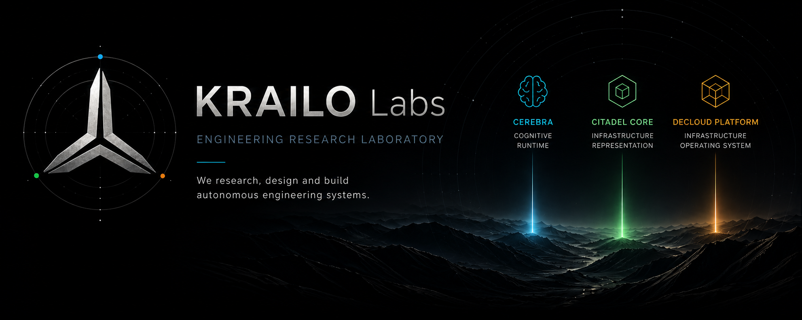

<p align="center">
  
</p>

<h1 align="center">KRAILO Labs</h1>

<p align="center">
Engineering Research Laboratory
</p>

<p align="center">
Researching, designing and building autonomous engineering systems.
</p>

---

## Current Research

- Autonomous Systems
- Cognitive Runtime
- Infrastructure Representation
- Infrastructure Operating Systems
- Distributed Infrastructure
- Cloud-native Platforms
- WebAssembly
- Blockchain Infrastructure

---

## Systems

| System | Role | Responsibility |
|---------|------|----------------|
| **Cerebra** | Cognitive Runtime | Persistent memory, contextual reasoning and autonomous agents. |
| **Citadel Core** | Autonomous Infrastructure Representation | Compose, represent and evolve autonomous infrastructure systems. |
| **DeCloud Platform** | Infrastructure Operating System | Provide the distributed execution foundation for autonomous infrastructure. |

---

## Architecture

```text
                     KRAILO Labs
                           │
         ┌─────────────────┼─────────────────┐
         │                 │                 │
         ▼                 ▼                 ▼
      Cerebra        Citadel Core      DeCloud Platform
 Cognitive Runtime   Infrastructure    Infrastructure
                     Representation    Operating System
```

---

## Design Principles

- Independent systems
- Clear responsibilities
- Composable architecture
- Distributed execution
- Autonomous operation

---

## Relationship

Each system addresses a different engineering domain and can evolve independently.

Together they provide complementary layers for building autonomous engineering systems.

---

## Research Status

KRAILO Labs is an active engineering research laboratory.

Current public systems:

- 🧠 **Cerebra** — Cognitive Runtime
- 🏛 **Citadel Core** — Autonomous Infrastructure Representation
- ⚙️ **DeCloud Platform** — Infrastructure Operating System

Additional systems will emerge as research evolves.
